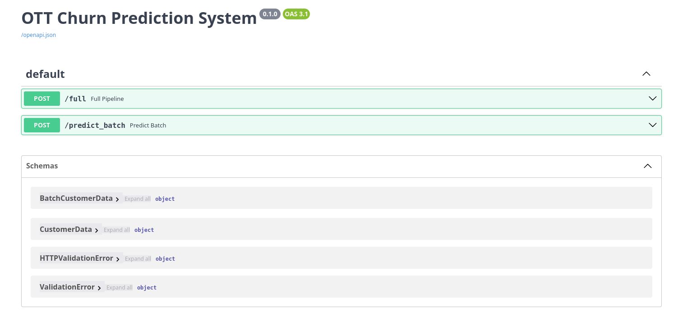
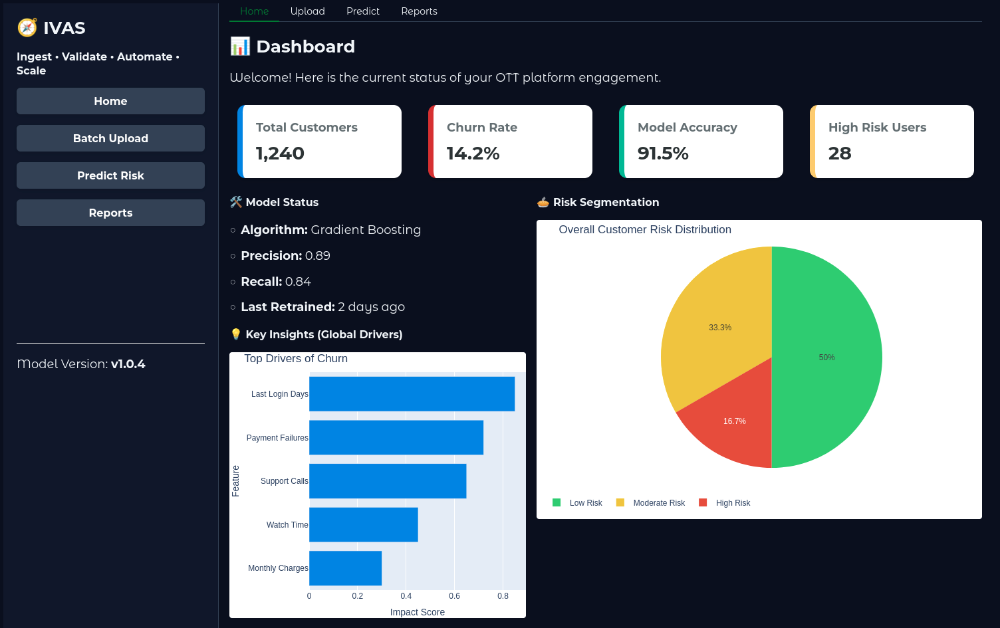
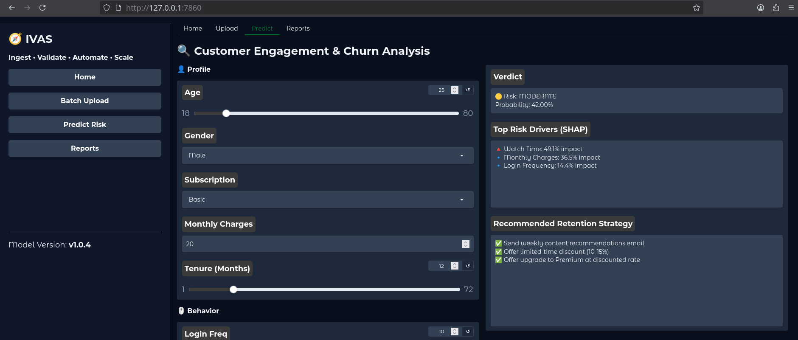
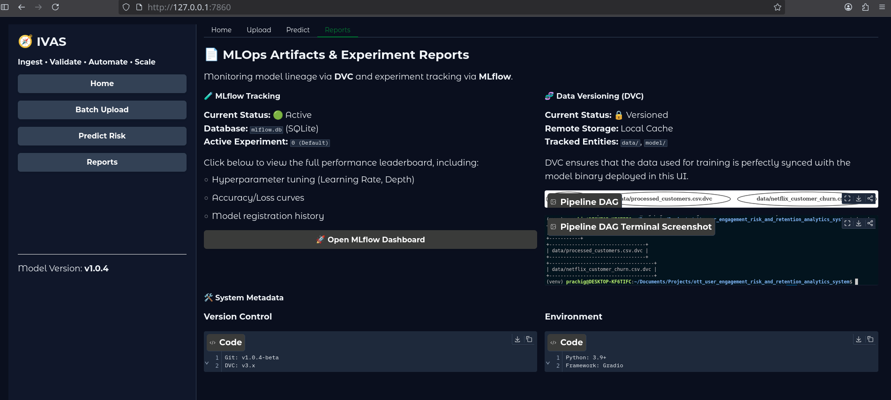
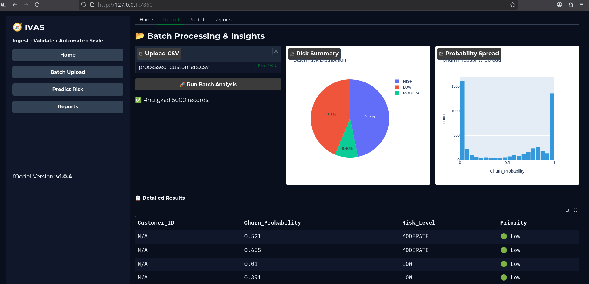
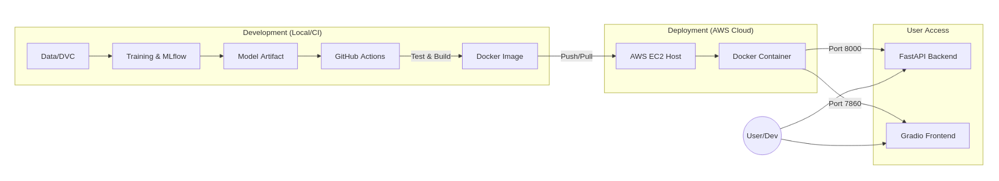
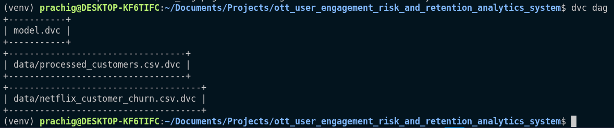

# OTT User Engagement, Churn Prediction and Retention Analytics System with MLOps Integration

## Abstract

This project presents an end-to-end machine learning system for predicting user churn and analyzing engagement patterns in Over-The-Top (OTT) streaming platforms. The system incorporates feature engineering to derive behavioral signals, followed by the development of a classification model for churn prediction. Beyond model development, the work integrates Machine Learning Operations (MLOps) practices, including data versioning, experiment tracking, containerization, continuous integration, and cloud deployment.

---

## 1. Problem Statement

OTT platforms face:

* High user churn
* Limited engagement visibility
* Lack of retention intelligence

The system predicts churn probability, quantifies engagement, and provides risk-based categorization for decision support.

---

## 2. System Overview

Pipeline:

Data → Preprocessing → Model Training → Inference → API → UI → Deployment

---

## 3. Data Engineering

### 3.1 Preprocessing

* Data cleaning and normalization
* Schema standardization

### 3.2 Feature Engineering

Behavioral features constructed:

* `watch_time`
* `login_frequency`
* `tenure_in_months`
* `payment_failures`
* `customer_support_calls`

---

## 4. Model Development

* Encoding: One-hot encoding
* Scaling: Standard scaler
* Model: Classification (Logistic Regression / Random Forest)
* Imbalance handling: Resampling

### Artifacts

* `churn_model.pkl`
* `encoder.pkl`
* `feature_names.pkl`

---

## 5. Prediction Pipeline

Ensures consistent transformations:

Input → Encoding → Alignment → Scaling → Prediction

### Risk Mapping

* High: ≥ 0.7
* Moderate: ≥ 0.4
* Low: < 0.4

.png)

---

## 6. System Implementation

### API

FastAPI-based inference service



### UI

Gradio-based interactive interface

   

### Containerization

Docker-based packaging

---

## 7. MLOps Integration

* Data Versioning: DVC
* Experiment Tracking: MLflow
* CI/CD: GitHub Actions
* Deployment: AWS EC2



---

## 8. Reproducibility and Execution

The following steps reproduce the system locally.

### 8.1 Clone Repository

```bash
git clone <repository-url>
cd <repository-folder>
```

### 8.2 Environment Setup

It is recommended to use a virtual environment:

```bash
python -m venv venv
source venv/bin/activate    # Linux/Mac
venv\Scripts\activate       # Windows
```

Install dependencies:

```bash
pip install -r requirements.txt
```

---

### 8.3 Data Preparation (if using DVC)

```bash
dvc pull
```

---

### 8.4 Run Application

```bash
python run_app.py
```

The application will be available at:
http://localhost:7860

---

### 8.5 Docker-Based Execution (Optional)

```bash
docker build -t ott-mlops .
docker run -p 7860:7860 ott-mlops
```

---

## 9. Project Structure

```bash
.
├──.dcv
├──.github/workflows
├── api
│   └── main.py
├── assets
│   ├── dvc_dag.png
│   └── dvc_dag_ss.png
├── data
│   ├── generate_data.py
│   ├── netflix_customer_churn.csv
│   ├── netflix_customer_churn.csv.dvc
│   ├── processed_customers.csv
│   └── processed_customers.csv.dvc
├── Dockerfile
├── main.py
├── model
│   ├── churn_model.pkl
│   ├── encoder.pkl
│   └── feature_names.pkl
├── model.dvc
├── README.md
├── requirements.txt
├── run_app.py
├── src
│   ├── explain.py
│   ├── __init__.py
│   ├── predict.py
│   ├── preprocess.py
│   ├── recommend.py
│   └── train_model.py
└── ui
    ├── components
    │   ├── __init__.py
    │   ├── sidebar.py
    │   └── widgets.py
    ├── __init__.py
    ├── pages
    │   ├── home.py
    │   ├── __init__.py
    │   ├── predict.py
    │   ├── reports.py
    │   └── upload.py
    └── styles.py
```

---
## 10. Conclusion

This project demonstrates an end-to-end MLOps system integrating data processing, model development, deployment, and automation. The design ensures reproducibility, scalability, and applicability in real-world OTT analytics.

---
